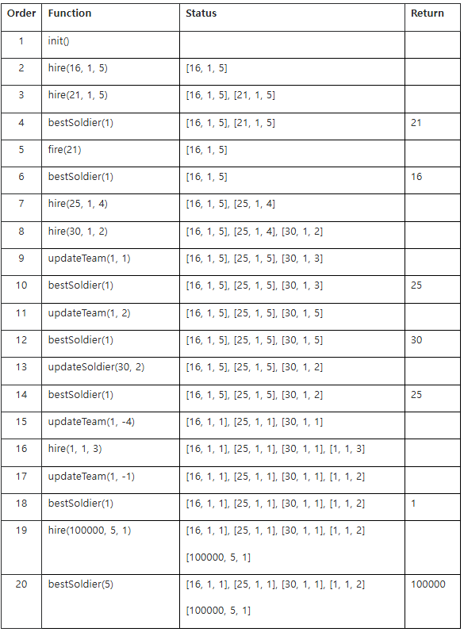

# [Pro] 13072. 병사관리

[제한 사항]

- 시간 : 25개 테스트케이스를 합쳐서 C++ 의 경우 3초 / Java 의 경우 3초
- 메모리 : 힙, 정적 메모리 합쳐서 256MB 이내, 스택 메모리 1MB 이내

## 문제 설명
병사들을 관리하는 프로그램을 작성하고자 한다.

병사들은 각각 고유번호, 소속팀, 평판 점수를 가지고 있다.

프로그램은 아래의 기능들을 수행할 수 있어야 한다.

병사 고용
병사 해고
병사의 평판 점수 변경
특정 팀에 속한 병사들의 평판 점수를 일괄 변경
특정 팀 안에서 가장 평판 점수가 높은 병사를 검색
아래 API 설명을 참조하여 각 함수를 구현하라.

※ 아래 함수 signature는 C/C++에 대한 것으로 Java에 대해서는 제공되는 Solution.java와 UserSolution.java를 참고하라.

 

아래는 User Code 부분에 작성해야 하는 API 의 설명이다.

## void init()
각 테스트 케이스의 처음에 호출된다.

테스트 케이스의 시작 시 고용된 병사는 없다.

## void hire(int mID, int mTeam, int mScore)
고유번호가 mID, 소속팀이 mTeam, 평판 점수가 mScore인 병사를 고용한다.

한 테스트 케이스 내에서 동일한 mID를 가진 병사가 여러 번 고용되는 경우는 없음이 보장된다.

 
### Parameters

mID : 고유번호 (1 ≤ mID ≤ 100,000)

mTeam : 소속팀 (1 ≤ mTeam ≤ 5)

mScore : 평판 점수 (1 ≤ mScore ≤ 5)

## void fire(int mID)
고유번호가 mID인 병사를 해고한다.

fire() 함수 호출 시, 고유번호가 mID인 병사가 고용되어 있음이 보장된다.

### Parameters

mID : 고유번호 (1 ≤ mID ≤ 100,000)

## void updateSoldier(int mID, int mScore)
고유번호가 mID인 병사의 평판 점수를 mScore로 변경한다.

고유번호가 mID인 병사가 고용되어 있음이 보장된다.

### Parameters

mID : 고유번호 (1 ≤ mID ≤ 100,000)

mScore : 평판 점수 (1 ≤ mScore ≤ 5)

## void updateTeam(int mTeam, int mChangeScore)
소속팀이 mTeam인 병사들의 평판 점수를 모두 변경한다.

소속팀이 mTeam인 병사가 한 명 이상 고용되어 있음이 보장된다.

 

updateTeam() 함수에서의 평판 점수 변경은 아래의 규칙에 따른다.

‘변경 전 평판 점수 + mChangeScore’가 5보다 클 경우, 평판 점수를 5로 변경한다.

‘변경 전 평판 점수 + mChangeScore’가 1보다 작을 경우, 평판 점수를 1로 변경한다.

그 외의 경우, 평판 점수를 ‘변경 전 평판 점수 + mChangeScore’로 변경한다.

### Parameters

mTeam : 소속팀 (1 ≤ mTeam ≤ 5)

mChangeScore : 평판 점수의 변화량 (-4 ≤ mChangeScore ≤ 4)

## int bestSoldier(int mTeam)
소속팀이 mTeam인 병사들 중 평판 점수가 가장 높은 병사의 고유번호를 반환한다.

평판 점수가 가장 높은 병사가 여러 명일 경우, 고유번호가 가장 큰 병사의 고유번호를 반환한다.

소속팀이 mTeam인 병사가 한 명 이상 고용되어 있음이 보장된다.

 
### Parameters

mTeam : 소속팀 (1 ≤ mTeam ≤ 5)

### Returns

평판 점수가 가장 높은 병사의 고유번호

## 예제

## 제약사항
1. 각 테스트 케이스 시작 시 init() 함수가 호출된다.

2. 각 테스트 케이스에서 hire() 함수의 호출 횟수는 100,000 이하이다.

3. 각 테스트 케이스에서 fire() 함수의 호출 횟수는 100,000 이하이다.

4. 각 테스트 케이스에서 updateSoldier() 함수의 호출 횟수는 100,000 이하이다.

5. 각 테스트 케이스에서 updateTeam() 함수의 호출 횟수는 100,000 이하이다.

6. 각 테스트 케이스에서 bestSoldier() 함수의 호출 횟수는 100 이하이다.

## 입출력
입출력은 제공되는 Main 부분의 코드에서 처리하므로 User Code 부분의 코드에서는 별도로 입출력을 처리하지 않는다.

Sample input 에 대한 정답 출력 결과는 “#TC번호 결과” 의 포맷으로 보여지며 결과가 100 일 경우 정답, 0 일 경우 오답을 의미한다.

## 주의사항
1. C 또는 C++로 답안을 작성하시는 응시자께서는 검정시스템에 제출 시, Language 에서 C++ 를 선택하신 후 제출하시기 바랍니다.

2. Main 과 User Code 부분으로 구성되어 있습니다.
  - Main : 수정할 수 없는 코드이며, 채점 시 비 정상적인 답안 검출 등 평가를 위한 로직이 추가 될 수 있습니다.
  - User Code : 실제 응시자가 작성해야 하는 코드이며, 제출 시에는 표준 입출력 함수가 포함되어 있으면 안 됩니다.

3. Local PC 에서 프로그래밍 시 유의 사항
  - A. 2개의 파일을 생성하셔야 합니다. (main.cpp / solution.cpp 또는 Solution.java / UserSolution.java )
  - B. Main 부분의 코드를 main.cpp 또는 Solution.java 에 복사해서 사용하시기 바랍니다.
  - C. sample_input.txt 를 사용하시기 위해서는 Main 부분의 코드 내에 표준 입력을 파일로 전환하는 코드 ( 주석처리 되어 있음 ) 의 주석을 풀어서 사용하시면 됩니다.
  - D. User Code 부분의 코드를 작성하신 후 서버에 제출하실 때, 디버깅을 위한 표준 입출력 함수를 모두 삭제 또는 주석 처리해 주셔야 합니다.

4. 문제 내에 제약조건을 모두 명시하지 않으므로 주어지는 코드를 분석하셔야 합니다.

5. 코드는 개발 언어에 따라 상이할 수 있으므로, 작성할 언어를 기준으로 분석하셔야 합니다.