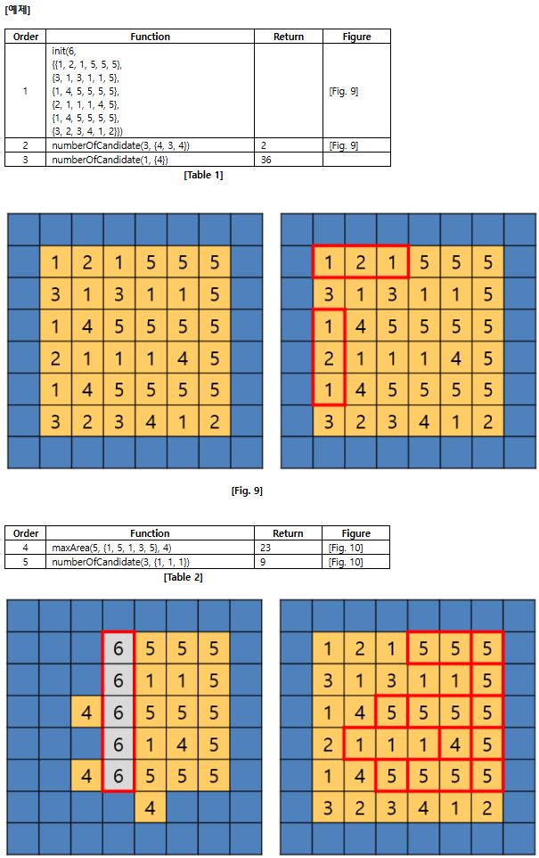
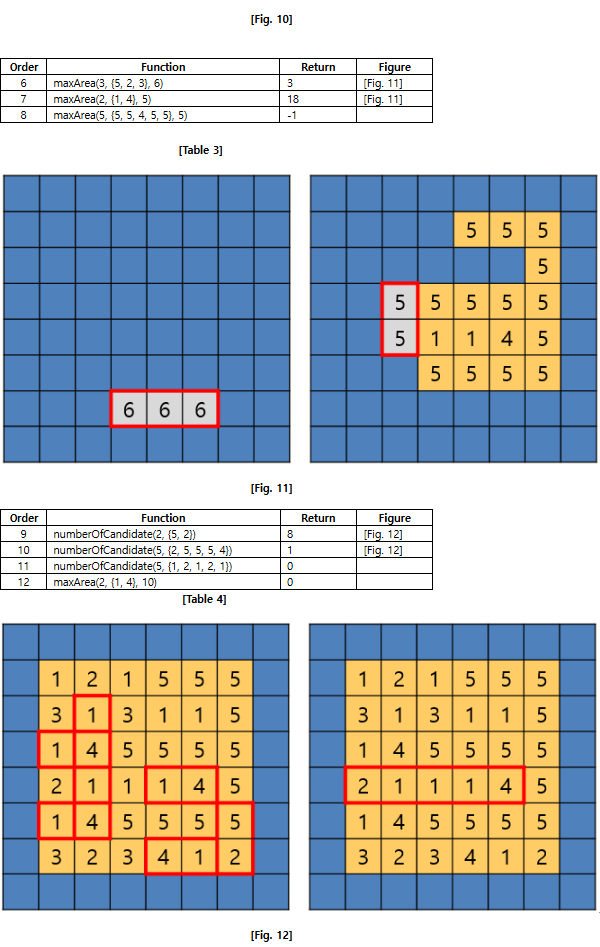

# [Pro] 14596 섬지키기

[제한 사항]

- 시간 : 25개 테스트케이스를 합쳐서 C++ 의 경우 3초 / Java 의 경우 3초 / Python의 경우 8초
- 메모리 : 힙, 정적 메모리 합쳐서 256MB 이내, 스택 메모리 1MB 이내

## 문제 설명
격자 모양의 섬이 하나 있다.

섬은 1 x 1 크기의 지역들로 이루어져 있다.

섬의 크기는 N x N이며, 바다에 둘러 쌓여 있다.

숫자는 각 지역의 고도를 나타낸다.

섬은 지구온난화로 인한 해수면 상승에 의해 바다에 잠길 위험에 처해 있다.

해수면이 mSeaLevel만큼 상승하면, 바닷물은 고도가 mSeaLevel-1이하인 지역으로 침투할 수 있게 된다.

단, 바닷물은 상하좌우 4방향으로만 육지에 침투할 수 있다.

즉, 대각선 방향으로 침투할 수는 없다.

1 x M 크기의 구조물을 통해, 섬을 어느정도 지킬 수 있는지 알아보고자 한다.

구조물은 일렬로 M개의 부분이 연결된 형태이다.

숫자는 각 부분의 높이를 나타낸다.
 
구조물은 섬에 설치될 수 있다. 단, 구조물이 섬의 M개 지역에 딱 들어맞도록 설치되어야 한다.

구조물이 설치된 M개 지역의 고도는, 해당하는 구조물 부분의 높이만큼 올라간다.

고도가 올라간 이후에는, M개 지역의 고도가 모두 일치해야만 한다.

일치하지 않을 것으로 예상될 때에는, 구조물을 설치할 수 없다.

구조물은 시계 방향으로 90도, 180도, 270도만큼 회전시킬 수 있다.

※ 아래 함수 signature는 C/C++에 대한 것으로 Java에 대해서는 제공되는 Solution.java와 UserSolution.java를 참고하라.

 

아래는 User Code 부분에 작성해야 하는 API 의 설명이다.

## void init()
각 테스트 케이스의 처음에 호출된다.

섬은 N x N 크기의 정사각형 모양이며, 1 x 1 크기의 정사각형 모양인 지역들로 이루어져 있다.

### Parameters
N : 섬의 한 변의 길이 (5 <= N <= 20)
mMap : 섬의 각 지역의 고도 (1 <= mMap[][] <= 5)

## int numberOfCandidate(int M, int mStructure[])
구조물 mStructure를 1개 설치했을 때, 나타날 수 있는 경우의 수를 반환한다.
설치 지역이 모두 동일하면, 같은 경우로 취급한다.
설치 지역이 1개라도 다르다면, 다른 경우로 취급한다.

구조물 mStructure의 크기는 1 x M이며, 1 x 1 크기의 정사각형 모양인 부분들로 이루어져 있다.

 
### Parameters
M : 구조물의 크기 (1 ≤ M ≤ 5)
mStructure : 구조물의 각 부분의 높이 (1 ≤ mStructure[] ≤ 5)

### Returns
구조물을 설치할 수 있는 경우의 수

## int maxArea(int M, int mStructure[], int mSeaLevel)
해수면이 mSeaLevel만큼 상승하여도 바다에 잠기지 않고 남아있는 지역의 개수가 최대가 되도록 구조물 mStructure를 1개 설치했을 때, 그 개수를 반환한다.
 
구조물 mStructure를 설치할 방법이 없는 경우에는, -1을 반환한다.
 
구조물 mStructure의 크기는 1 x M이며, 1 x 1 크기의 정사각형 모양인 부분들로 이루어져 있다.

실제로 설치하지는 않음에 유의하라.

즉, 각 테스트 케이스에서 섬의 각 지역의 고도는 init()에서의 상태 그대로 유지된다.

### Parameters
M : 구조물의 크기 (1 ≤ M ≤ 5)
mStructure : 구조물의 각 부분의 높이 (1 ≤ mStructure[] ≤ 5)
mSeaLevel : 해수면의 상승 폭 (1 ≤ mSeaLevel ≤ 10)

### Returns
최대 지역 개수

## 예제

## 제약사항
1. 각 테스트 케이스 시작 시 init() 함수가 호출된다.

2. 각 테스트 케이스에서 numberOfCandidate() 함수의 호출 횟수는 150,000 이하이다.

3. 각 테스트 케이스에서 maxArea() 함수의 호출 횟수는 50 이하이다.

4. 각 테스트 케이스에서 maxArea() 함수의 구조물 mStructure를 설치할 수 있는 경우의 수의 총합은 5,000 이하이다.

## 입출력
입출력은 제공되는 Main 부분의 코드에서 처리하므로 User Code 부분의 코드에서는 별도로 입출력을 처리하지 않는다.

Sample input 에 대한 정답 출력 결과는 “#TC번호 결과” 의 포맷으로 보여지며 결과가 100 일 경우 정답, 0 일 경우 오답을 의미한다.

## 주의사항
1. C 또는 C++로 답안을 작성하시는 응시자께서는 검정시스템에 제출 시, Language 에서 C++ 를 선택하신 후 제출하시기 바랍니다.

2. Main 과 User Code 부분으로 구성되어 있습니다.
  - Main : 수정할 수 없는 코드이며, 채점 시 비 정상적인 답안 검출 등 평가를 위한 로직이 추가 될 수 있습니다.
  - User Code : 실제 응시자가 작성해야 하는 코드이며, 제출 시에는 표준 입출력 함수가 포함되어 있으면 안 됩니다.

3. Local PC 에서 프로그래밍 시 유의 사항
  - A. 2개의 파일을 생성하셔야 합니다. (main.cpp / solution.cpp 또는 Solution.java / UserSolution.java )
  - B. Main 부분의 코드를 main.cpp 또는 Solution.java 에 복사해서 사용하시기 바랍니다.
  - C. sample_input.txt 를 사용하시기 위해서는 Main 부분의 코드 내에 표준 입력을 파일로 전환하는 코드 ( 주석처리 되어 있음 ) 의 주석을 풀어서 사용하시면 됩니다.
  - D. User Code 부분의 코드를 작성하신 후 서버에 제출하실 때, 디버깅을 위한 표준 입출력 함수를 모두 삭제 또는 주석 처리해 주셔야 합니다.

4. 문제 내에 제약조건을 모두 명시하지 않으므로 주어지는 코드를 분석하셔야 합니다.

5. 코드는 개발 언어에 따라 상이할 수 있으므로, 작성할 언어를 기준으로 분석하셔야 합니다.